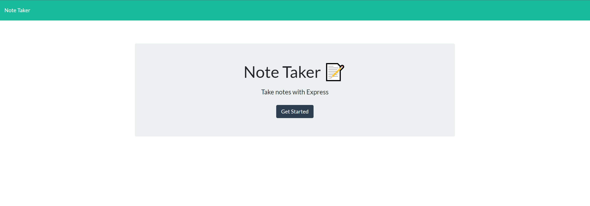

# Note Taker

## Description
- Uses express.js to run a note taking app. You can add a note, delete a note, and view any of the loaded notes. Notes are stored in the server and can be accessed anywhere.
## Table of Contents
- [Go to Screenshots](#screenshots)
- [Go to Installation Instructions](#install-instructions)
- [Go to Usage](#usage)
- [Go to Contributing](#contributing)
- [Go to Questions](#questions)
## Screenshots

## Install Instructions
- You can clone the repo and run npm install to install the dependencies and run from localhose. The app is also deployed live using [Heroku](https://secret-castle-69488.herokuapp.com/).
## Usage
- Once installed, go to the webpage. Click on notes to go to the notes page. Saved notes will automatically load into the left column, you can add new notes in the right column and then clicking the save icon.
## Contributing
- Either submit an issue or submit a pull request if you've made some changes yourself.
## Questions
- [GitHub Repo](https://github.com/SteveB29/note-taker)
- [My GitHub](https://github.com/SteveB29)
- [Email Me](mailto:steven.bendrick@gmail.com)